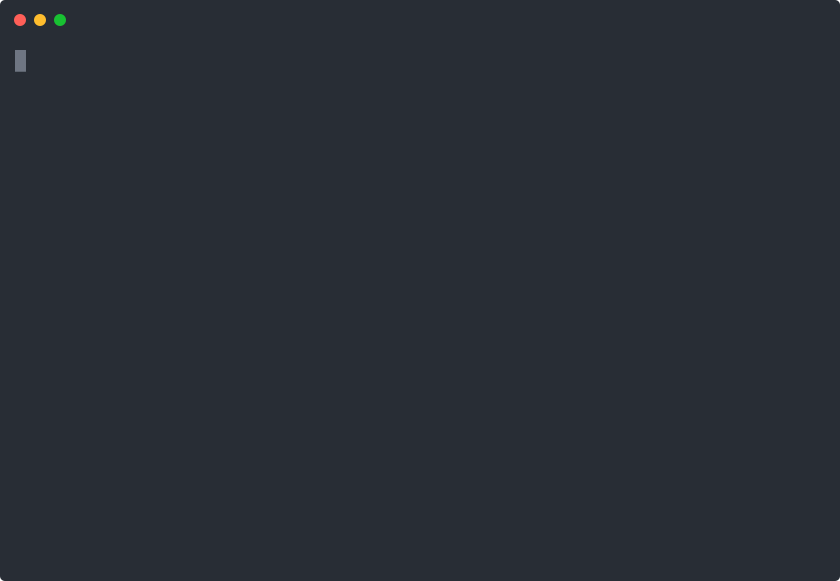
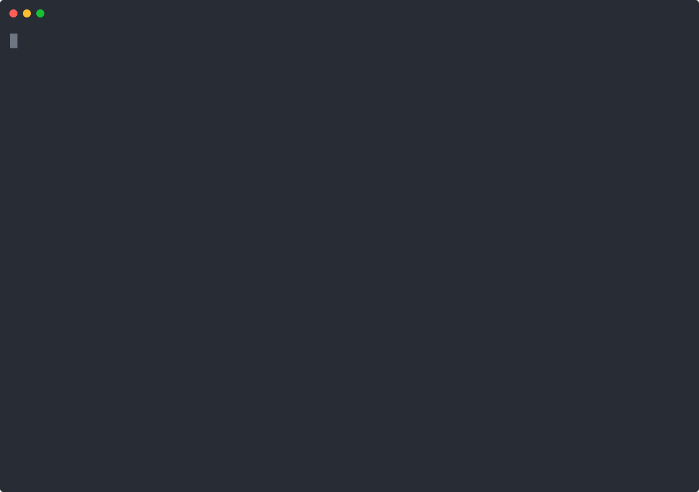

# FUNWAVE-TVD

This is a beta version. Please report any bugs you encounter.
The released version can be downloaded from [FUNWAVE-TVD Documentation](http://fengyanshi.github.io/build/html/index.html).

## Building with CMake

    git clone https://github.com/fengyanshi/FUNWAVE-TVD.git

### Cloning the FUNWAVE repository

### Creating a CMake build directory

    mkdir build
    cd build
    cmake ..

> [!NOTE]
> This example uses the `build` directory; however, any alternative directory is acceptable. The general usage of the `cmake` command is as follows:  
> `-S` specifies the source directory of the FUNWAVE-TVD repository  
> `-B` specifies the build directory where files will be generated

    cmake -S /path/to/source -B /path/to/build

> [!NOTE]
> Due to potential issues with CMake auto-configuration on macOS, users may need to specify a toolchain file.

    mkdir build
    cd build
    cmake -DCMAKE_TOOLCHAIN_FILE=macos_mpi.cmake ..

> [!TIP]
> The path for `CMAKE_TOOLCHAIN_FILE` is relative to the **source directory** (`-S`), not your current working directory. You can use the same path for the toolchain file even when specifying custom build paths.

### Configuring FUNWAVE and optional modules

You can manage project settings—such as MPI precipitation, or sediment modules—using the interactive CMake configuration tool:

    ccmake .

#### CCMake Configuration Controls

| Key                | Action                                                       |
| :----------------- | :----------------------------------------------------------- |
| **Up/Down Arrows** | Navigate through the list of configuration options.          |
| **ENTER**          | Edit the selected option (Toggle ON/OFF or edit text).       |
| **c**              | Configure. Apply changes and re-run dependency checks.       |
| **g**              | Generate. Save configuration and exit (creates build files). |
| **e**              | View Error Log. Press this if configuration fails.           |
| **t**              | Toggle Advanced Mode. Show/Hide hidden variables.            |
| **q**              | Quit. Exit without generating build files.                   |

> [!NOTE]
> Use the interface to toggle options or edit paths. Press **'c'** to run the configuration check. You may need to press **'c'** multiple times until all variables are resolved and the **'g'** (Generate) option becomes available. Once generated, press **'g'** to finalize the build files and exit

### Compiling FUNWAVE executable

    make -j 4

