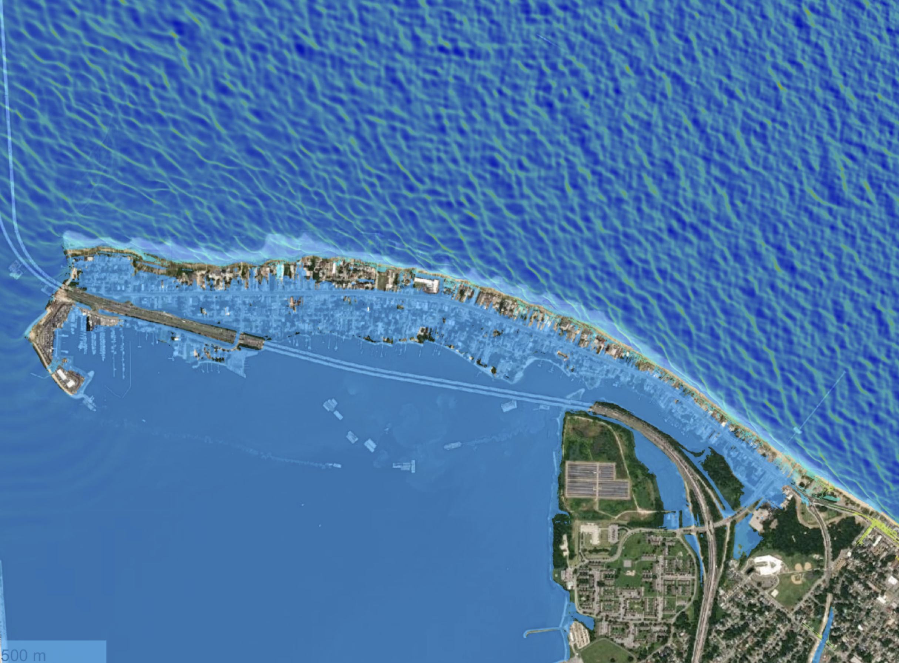
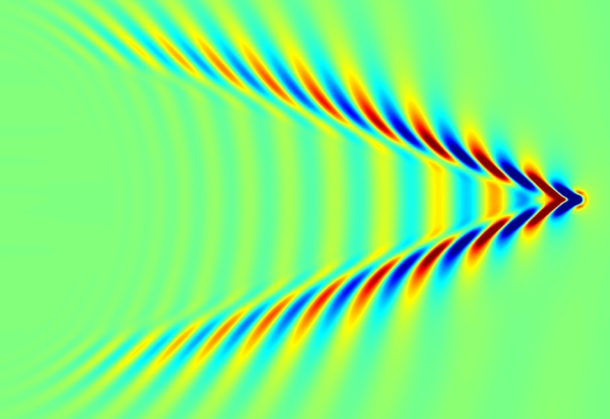
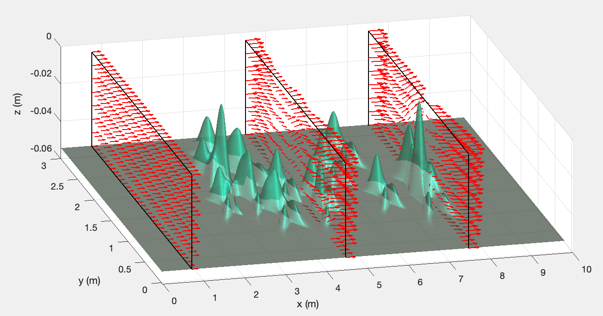

.. fully dispersive model documentation master file, created by
   sphinx-quickstart on Sun Feb 26 11:21:26 2023.
   You can adapt this file completely to your liking, but it should at least
   contain the root `toctree` directive.

Highly Dispersive Nonhydrostatic Wave Model
==================================================

This website documents the development of a highly-dispersive wave model which can be used for modeling ship-wakes and wind waves in relatively deep water. A highly dispersive model was developed based on the surface flow technique used for a non-hydrostatic model. It has a multiple layer system, which can be configured by a user for a wave application in the highly dispersive wave regime. The development of the highly-dispersive wave model followed the existing FUNWAVE-TVD model framework. The model I/O files are consistent with that of FUNWAVE-TVD, facilitating the existing FUNWAVE-TVD users to use the new solver. The program is maitained  in the `GITHUB repository <https://github.com/fengyanshi/Fully_dispersive_model>`_

.. toctree::
   :maxdepth: 2

   intro
   model
   modules
   setup
   examples
   references

SEARCH IN SITE
==================

* :ref:`search`
