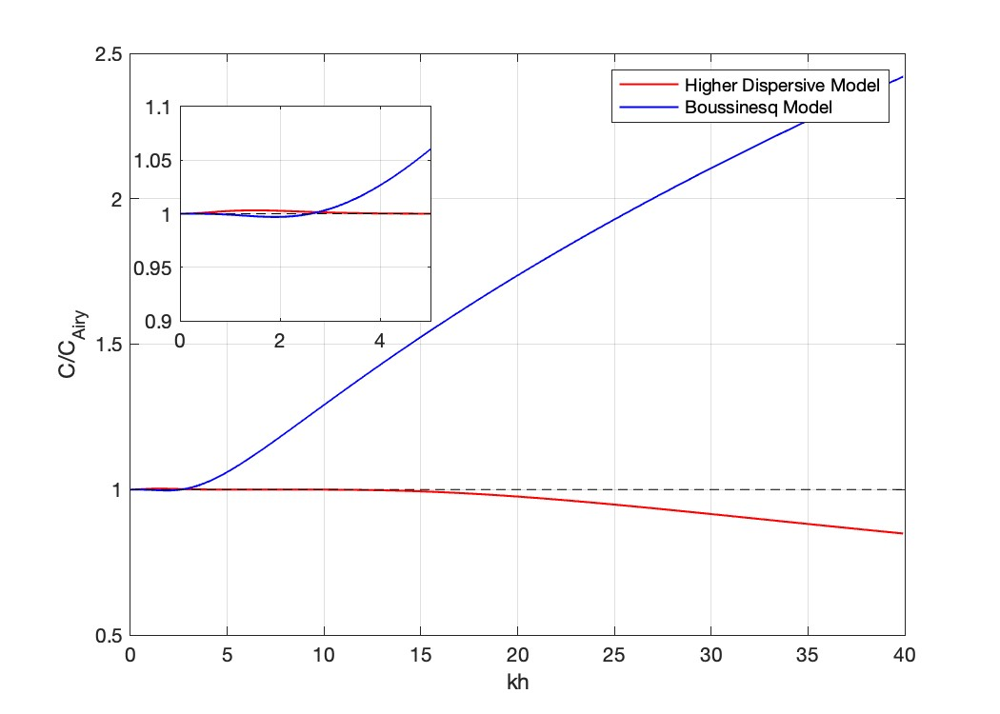

**INTRODUCTION**
======================

The success of the FUNWAVE-TVD model is well noted in modeling the surface wave evolution from intermediate water depth to the swash zone. It removes the restriction of the weak nonlinearity, demonstrating significant improvements of wave dispersion property and nonlinearity. Currently, however, there are two major limitations in practical applications of the model: (1) highly dispersive waves common in intermediate to deep water regions and (2) external forcing associated with large-scale processes such as tides and storm surges. 

The current version of the model resolves waves up to :math:`kh \sim 3.14`, where :math:`kh` is a parameter to measure wave dispersion. For surface waves beyond this range, the model accuracy decreases considerably due to errors in calculating wave celerity; thereby not resolving properly the shorter wave component. This is a considerable limitation, as the model is increasingly being applied across larger computational domains. This model seeks to overcome these limitations and enhance the computational utility of the model. 

The figure shows the comparison of the normalized phase velocity :math:`C/C_{Airy}` between the present model with three layers and the Boussinesq model. Compared with the Boussinesq model, which maintains a 0.2 %
relative for :math:`kh < \pi`, the present model with only three layers can correctly predict the phase velocity with the same error limit up to :math:`kh \sim 4 \pi`.
