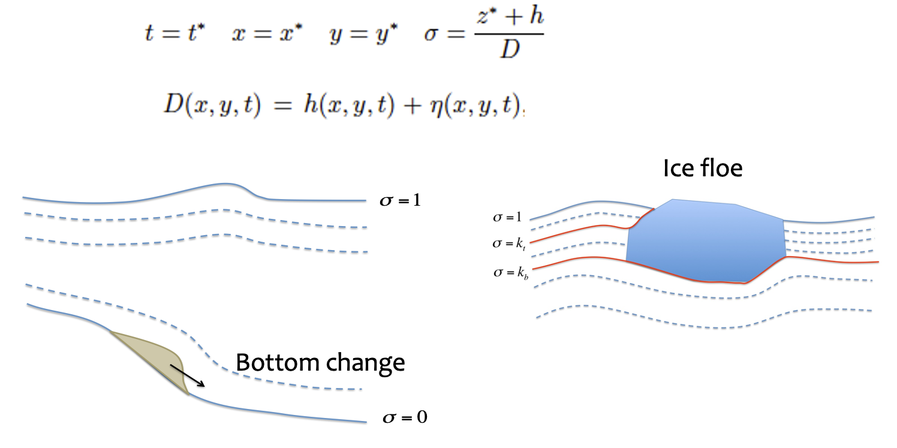

**THEORY AND NUMERICS**
============================

.. toctree::
   :maxdepth: 2

   model_equation
   model_flow_surface
   model_numerics

The figure shows :math:`sigma`-coordinate transformation, which can make the model computational ly more efficient. It can also deal with the morphological change and floating objects. 