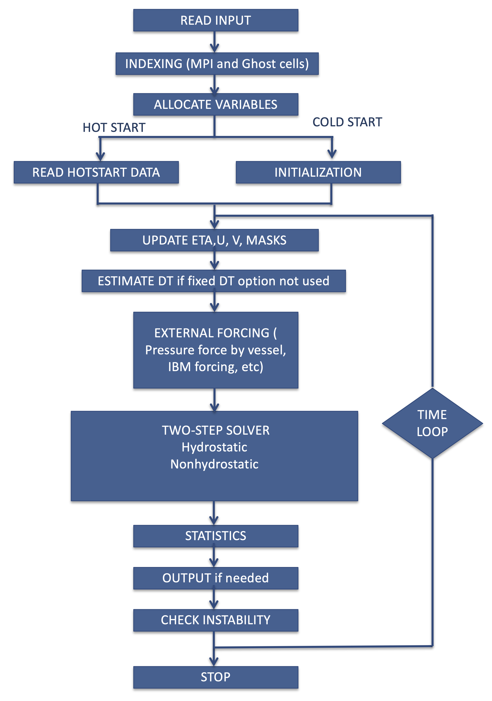

Central Module
*****************

The central module solves the :math:`\sigma`-coordinate-based Navier Stokes equations using the two-step method.  It takes care basic functions such as wavemaker, wave breaking, spongelayers, boundary conditions and model input and output.

In parallelizing the computational model, we used a domain decomposition technique to subdivide the problem into multiple regions and assign each subdomain to a separate processor core. Each subdomain region contains an overlapping area of ghost cells, two-row deep, as required by the second-order scheme. The Message Passing Interface (MPI) with non-blocking communication is used to exchange data in the overlapping region between neighboring processors. 

The model flow-chart is shown in the figure. 