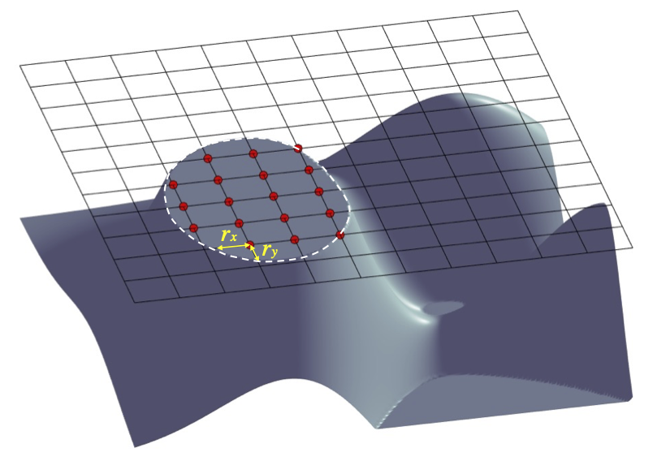
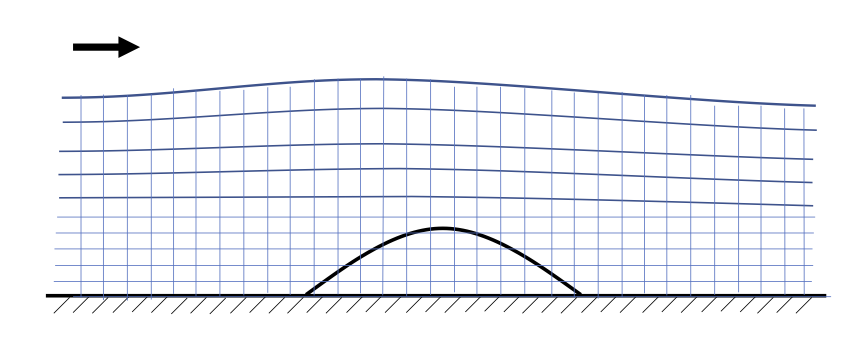
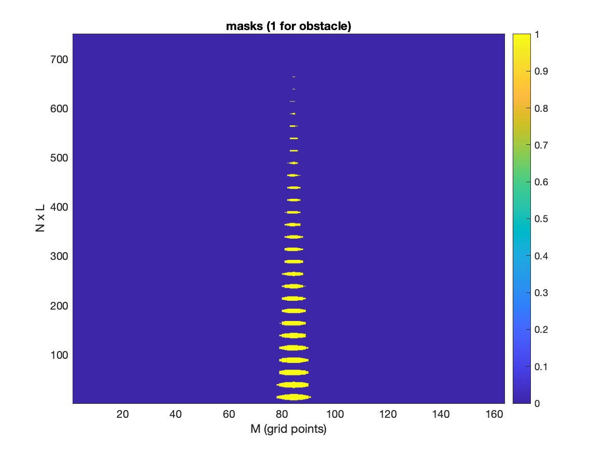
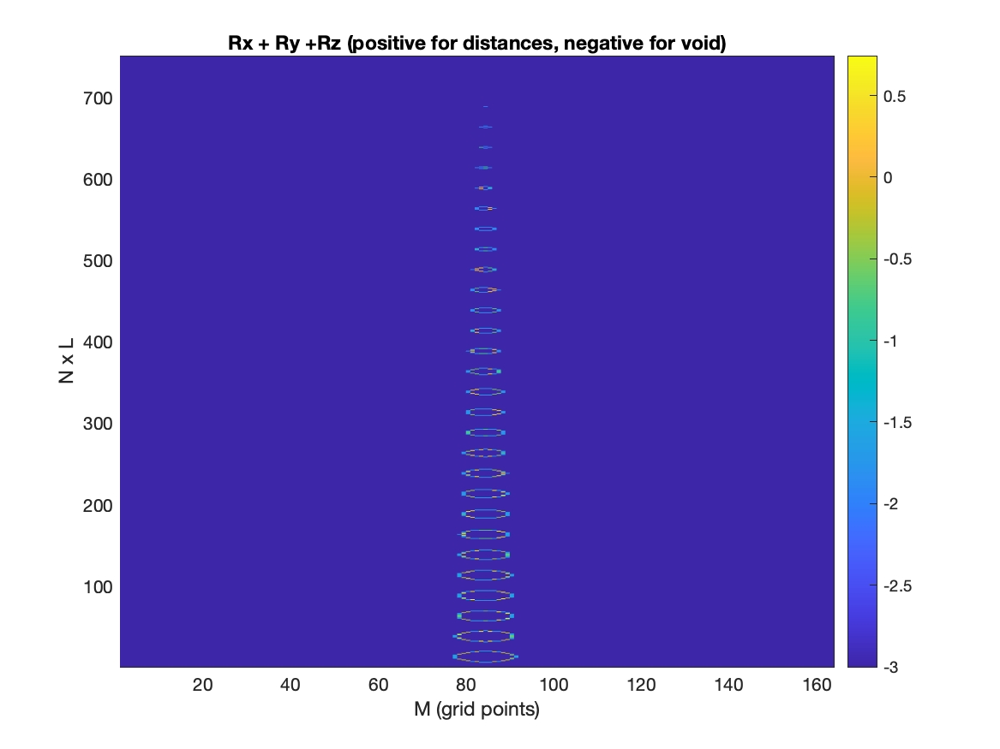

Wave-Structure Interaction
=============================

Theory: immersed boundary conditions
*********************************************

In the immersed boundary(IB) method, the structures are treated as virtual bodies and replaced by immersed boundary forces applied on their boundaries. To implement the IB method, an additional IB force (IBF) is added to the projection step of the solver (Ha et al., 2014). 

 .. math:: 
   \frac{U^{(k)}-U^{*}}{\Delta t} = S_p^{(k)} + f_{IBF}^{(k)}

where :math:`k = 1,2` at the first and second stages, respectively. The IB force :math:`f_{IBF}` is defined as a Dirac delta function, which has non-zero values only at the structure boundaries. An IB velocity :math:`\tilde{U}` is employed to enforce a no-slip boundary condition at the structure boundaries. Thus the IBF is given by

 .. math:: 
    f_{IBF}^{(k)} = \tilde{U}^{(k)} - U^{*} - S_p^{(k)}

The IBF is applied at the cell center in the fluid domain nearest the solid surface. To find the IB velocity at the cell center, an interpolation is usually required.

Representation of 3D geometry of obstacles 
*********************************************

Configuration of 3D object surface. Red points represent solid object masks at a vertical level s. The masks at the surface boundary have two parameters (:math:`r_x, r_y`), representing distances to the boundary (white line) in :math:`x` and :math:`y`, respectively. Model input is through the so-called obstacle files, including masks, :math:`r_x` and :math:`r_y`. Values of (:math:`r_x, r_y`) are optional. If users do not provide (:math:`r_x, r_y`) the default (:math:`r_x, r_y`) = :math:`0`.

Pre-processing
*****************

An example for preprocessing is in /lloyd\_ibm\_coarse\_grid/. It's the case of Lloyd experiment using very coarse grid (0.06 x0.06 m). Model setup:

  .. code-block:: rest  
 
     ! cell numbers
      Mglob = 164
      Nglob = 25
      Kglob = 30

     ! grid sizes
      DX = 0.06
      DY = 0.06

This figure is only for demonstration. 

In /lloyd\_ibm\_coarse\_grid/, use mk\_obstacle.m to generate three files: obs\_mask.txt, obs\_rx.txt and obs\_ry.txt, which are input files of the model. 

To check if the generated files are correct, check the figures:

Masks of Lloyd case. Note: the y-axis is N-dimension x L-levels.  

Rx + Ry + Rz of Lloyd case. Check the sum (Rx, Ry, Rz) makes closed circles.  

