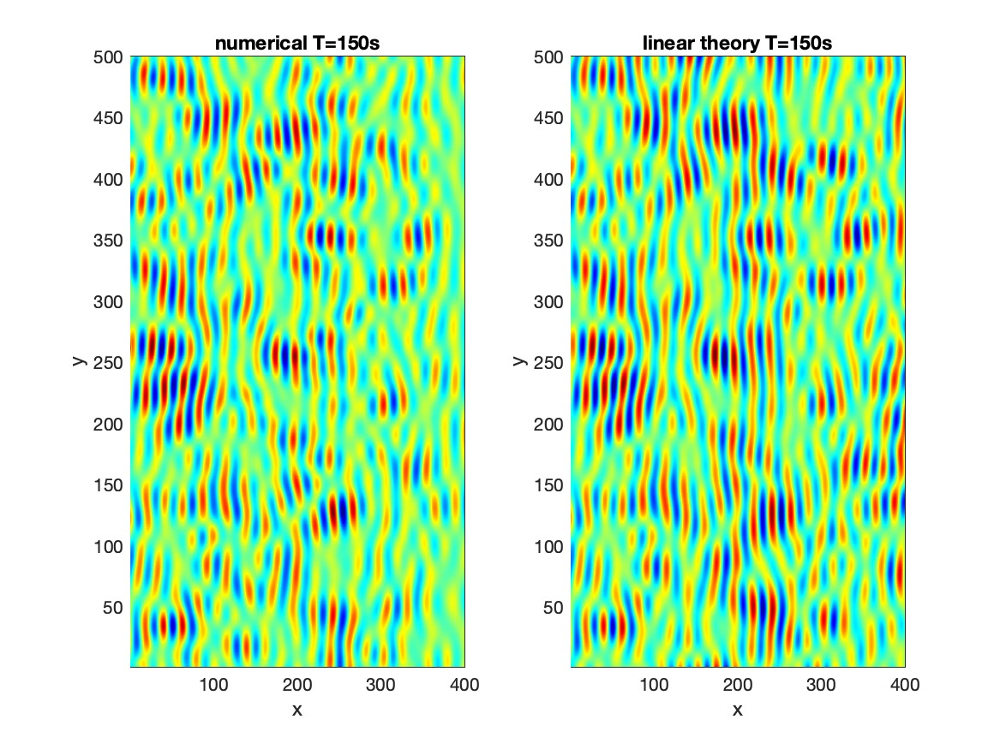

Tide and Surge Module
***************************

Theory
-----------

The basic technique follows the sponge layer theory introduced by `Larsen and Dancy (1983) <https://www.sciencedirect.com/science/article/abs/pii/0378383983900224>`_. Instead of attenuating the surface elevation and flow velocity to zero at the end of a sponge layer, we dampen shortwaves with respect to a reference level based on the method proposed by `Chen et al. (1999) <https://ascelibrary.org/doi/abs/10.1061/(ASCE)0733-950X(1999)125:4(176)>`_. The dependent variables (:math:`\eta, u, v`) are attenuated as

.. math:: \eta_i = \eta_{ref} + (\eta_i - \eta_{ref})/C_s

.. math:: u_i = u_{ref} + (\eta_i - u_{ref})/C_s

where :math:`( )_{ref}` denotes the reference values which either tidal level or tidal current or both. :math:`C_s` is the damping coefficient which is the same as that used in a sponge layer (see sponge layer section for detail), i.e., 

.. math:: C_s = \alpha_s^{\gamma_s^{(i-1)}}

in which :math:`i` is grid numbers, (:math:`i = 1, 2, ...`). 

in which :math:`\alpha_s` and :math:`\gamma_s` are parameters. 
 
 The source functions are based on the linear wave solutions at the flat bottom, for component :math:`l`

 .. math:: 
    \eta^l = a^l \cos(k_x^l x + k_y^l y - \sigma^l t + \phi^l)
 
 .. math:: 
    u^l = a^l \sigma^l \frac{\cosh k^l(h+z_\alpha)}{\sinh k^l h} \cos(k_x^l x + k_y^l y - \sigma^l t + \phi^l))\cos(\theta^l)
 
 .. math:: 
    v^l = a^l \sigma^l \frac{\cosh k^l(h+z_\alpha)}{\sinh k^l h} \cos(k_x^l x + k_y^l y - \sigma^l t + \phi^l))\sin(\theta^l)
 
 where :math:(a, k, \sigma, \theta)^l` are wave amplitude, wavenumber, angular frequency, and wave angle, respectively, for component :math:`l`. (:math:`k^l_x,k^l_y`) are the wavenumber components in :math:`(x,y)`:  :math:`k^l_x = k^l \cos\theta^l, k^l_y = k^l \sin \theta^l`.  :math:`z_\alpha` is the :math:`z` at the vertical layer.  
  
 The solution for :math:`l=[1,2,... L]` can be obtained by summating all wave components, for example, for wave surface,

 .. math:: 
    \eta = \sum_{l=1}^{L}  a^l \cos(k_x^l x + k_y^l y - \sigma^l t + \phi^l)
 
 To increase the computational efficiency, we separate the time-independent variables from the formula (Shi et al., 2003). For wave component :math:`l`,  we use two-index numbers, :math:`l(l_f, l_d)`, representing indexes for frequency and wave direction, respectively. :math:`l_f = 1 \sim N_f`, :math:`l_d = 1 \sim N_d`, and :math:`L = N_f \times N_d`.

 .. math:: 
    \eta = \sum_{l_f}^{N_f} C^{l_f} \cos \sigma^{l_f} t + \sum_{l_f}^{N_f} S^{l_f} \sin \sigma^{l_f} t
  \label{eta}
 
 where

 .. math:: 
    C^{l_f} = \sum_{l_d=1}^{N_d} D^{(l_f,l_d)} \cos\left(k_x^{(l_f,l_d)}  x +k_y^{(l_f,l_d)}  y +\phi^{(l_f,l_d)}\right )
 
 .. math::  
    S^{l_f} = \sum_{l_d=1}^{N_d} D^{(l_f,l_d)} \sin\left(k_x^{(l_f,l_d)}  x +k_y^{(l_f,l_d)}  y +\phi^{(l_f,l_d)}\right )

Verification
----------------

The problem can be verified by wave surface calculated based on the formulas above.

When using the random function :math:`\phi^{(l_f,l_d)}` with random numbers :math:`0 \sim 2\pi`. The solution for the surface is shown in the figure below. 

 

