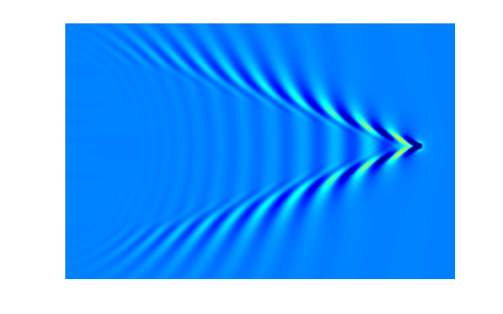
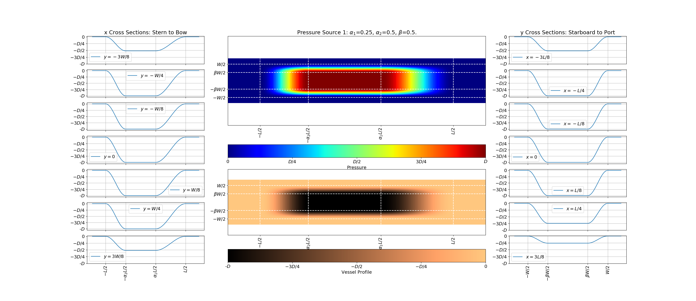

Ship-Wake Module
*****************

We have implemented the TYPE I (Lam et al., 2022) of pressure source function for ship-wave generation.

The pressure disturbance with a center point at :math:`(x^*, y^*)` is given by:

.. math:: p_a(\tilde{x},\tilde{y},t) = P f(\tilde{x},t) q(\tilde{y},t),

where:

.. math:: f(\tilde{x},t) = \left \{ \begin{array}{rl} \cos^2\left [\frac{\pi(\tilde{x}-x^*(t)-\frac{1}{2}\alpha_1 L)}{(1-\alpha_1) L} \right ], & \frac{1}{2}\alpha_1 L < \tilde{x} - x^*(t) \le \frac{1}{2}L \\ \cos^2\left [\frac{\pi(x^*(t)-\tilde{x}-\frac{1}{2}\alpha_2 L)}{(1-\alpha_2) L} \right ], & -\frac{1}{2}L \le \tilde{x}-x^*(t) \lt -\frac{1}{2}\alpha_2 L \\1, &  - \frac{1}{2}\alpha_2 L \le \tilde{x} - x^*(t) \le \frac{1}{2}\alpha_1 L \end{array} \right.

.. math:: q(\tilde{y},t) = \left \{ \begin{array}{rl} \cos^2 \left [\frac{\pi(|\tilde{y}-y^*(t)|-\frac{1}{2}\beta W)}{(1-\beta) W} \right ], & \frac{1}{2}\beta W < |\tilde{y} - y^*(t)| \le \frac{1}{2}W \\ 1, &  |\tilde{y} - y^*(t)| \le \frac{1}{2}\beta W \end{array} \right.

In the rectangle, :math:`- L/2 \le \tilde{x} - x^*(t) \le L/2`  and  :math:`- W/2 \le \tilde{y} - y^*(t) \le R/2`, and zero outside this region; :math:`L` and :math:`W` represent the length and width of the pressure source, respectively. :math:`\alpha_1`, :math:`\alpha_2` and :math:`\beta` are parameters representing the shape of the draft region, and :math:`0\le(\alpha_1, \alpha_2, \beta)<1`. They can be evaluated using the block coefficient of a watercraft as described below. (:math:`\tilde{x}, \tilde{y}`) is the coordinate system for the pressure disturbance which may be rotated by an angle relative to the Boussinesq coordinate system (:math:`x,y`). :math:`P` is a parameter controlling the surface displacement. In fact, :math:`p_a` is the static depression around the vessel.  

In contrast to the formulation of the pressure distribution in the previous study (`Torsvik et al., 2008 <https://doi.org/10.1061/(ASCE)0733-950X(2009)135:3(120)>`_),  :math:`P` has a unit of meters and can be interpreted as the inverse barometer effect corresponding to the static surface depression for a stationary vessel. 

The values of :math:`\alpha_1`, :math:`\alpha_2`, and :math:`\beta` are shape parameters and can be obtained by adjusting :math:`\alpha_1`, :math:`\alpha_1` and :math:`\beta` to get the displaced volume (static submerged volume of the vessel):

.. math:: V_{\mbox{sub}} = \iint p_a d\tilde{x} d\tilde{y}

which should match a given block coefficient :math:`C_B` defined by:

.. math:: C_B = \frac{V_{\mbox{sub}} }{L \cdot W \cdot D}

in which :math:`D` represents draft of a vessel. An example of how the pressure source is implemented in FUNWAVE is shown in the figure below for :math:`\alpha_1, \alpha_2,` and :math:`\beta = 0.25, 0.5,` and :math:`0.5`, respectively. Click on the image to enlarge it.

    