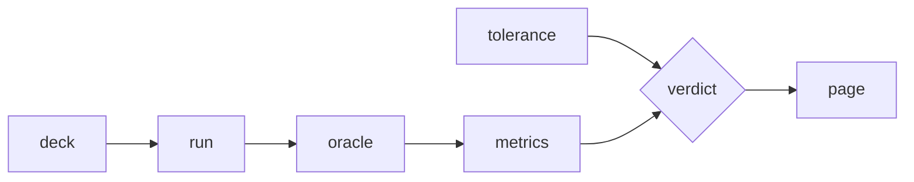

# Validation

Evidence that the model produces the right answer, case by case. Every case pairs a
deck with a reference — a closed-form solution or a published laboratory experiment
— an oracle reducing the run to a small set of metrics, and a tolerance those
metrics must meet.

Pages here are generated from `test/validation/validation_config.yaml` and the
results record a board writes, so the setup shown is the setup that ran, and every
number carries the engine revision and board that produced it.

- [Analytic](analytic/index.md) — closed-form, convergence and conservation oracles
- [Lab](lab/index.md) — published laboratory experiments
